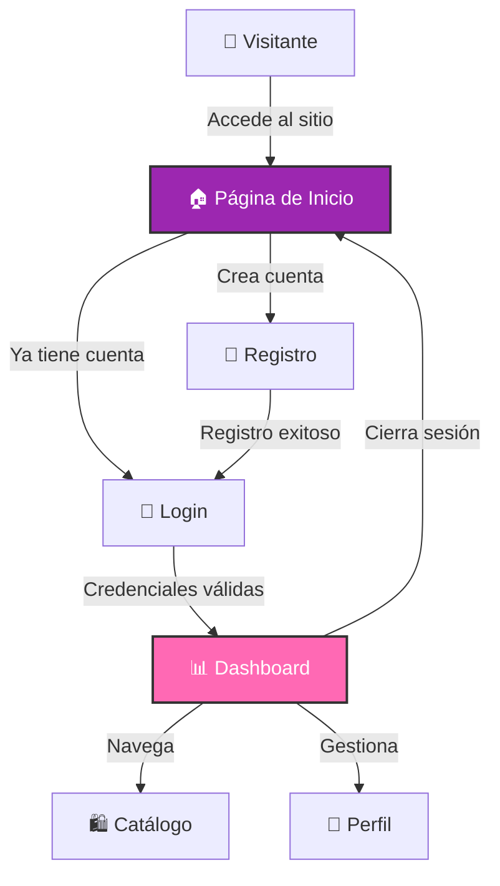

<table>
  <tr>
    <td width="150">
      
    </td>
    <td>
      <h1>Elegance Store</h1>
      <em>"Moda elegante para cada ocasión"</em>
    </td>
  </tr>
</table>


## 💡 Sobre Elegance Store

**Elegance Store** es una tienda de ropa en línea con un sistema completo de autenticación y gestión de usuarios. Diseñada con un estilo elegante y moderno, ofrece una experiencia de compra premium.

### ✨ Características Principales

* **Sistema de Autenticación** - Registro e inicio de sesión seguros
* **Dashboard de Usuario** - Panel personalizado para cada cliente
* **Diseño Responsive** - Adaptable a cualquier dispositivo
* **Interfaz Elegante** - UI/UX premium y moderna

### 🔄 Flujo de Usuario



---

## ✨ Características Destacadas

| ⚡ Funcionalidad | 📌 Detalle |
|-----------------|-----------|
| **Autenticación Segura** | Contraseñas hasheadas con `password_hash()` de PHP |
| **Sesiones Persistentes** | Manejo de sesiones para usuarios logueados |
| **Validación de Formularios** | Validación tanto en cliente como en servidor |
| **Diseño Moderno** | Interfaz limpia con animaciones suaves |
| **Responsive Design** | Compatible con móviles, tablets y desktop |

---

## 🎨 Badges & Estado


---

## ⚙️ Instalación y Configuración

### 1️⃣ Clonar el Repositorio

```bash
git clone https://github.com/JoseEduardoGR/Elegance-Store.git
cd Elegance-Store
```

### 2️⃣ Configurar Base de Datos

Importa el archivo SQL ubicado en `sql/` a tu servidor MySQL:

```sql
CREATE DATABASE elegance_store;
USE elegance_store;
SOURCE sql/database.sql;
```

### 3️⃣ Configurar Conexión

Edita el archivo `config/database.php` con tus credenciales:

```php
private $host = "localhost";
private $db_name = "elegance_store";
private $username = "tu_usuario";
private $password = "tu_password";
```

### 4️⃣ Iniciar Servidor

```bash
php -S localhost:8000
```

Luego abre `http://localhost:8000` en tu navegador.

---

## 📂 Estructura del Proyecto

```
ELEGANCE-STORE/
├── config/
│   └── database.php      # Configuración de base de datos
├── css/
│   └── styles.css        # Estilos personalizados
├── includes/
│   └── functions.php     # Funciones auxiliares
├── js/
│   └── validation.js     # Validación de formularios
├── sql/
│   └── database.sql      # Esquema de la base de datos
├── dashboard.php         # Panel de usuario
├── index.php             # Página principal / Login
├── register.php          # Registro de usuarios
├── logout.php            # Cerrar sesión
├── LICENSE               # Licencia MIT
└── README.md             # Este archivo
```

---

## 🛠️ Tecnologías Utilizadas

| Tecnología | Uso |
|------------|-----|
| **PHP 8+** | Backend y lógica del servidor |
| **MySQL** | Base de datos relacional |
| **PDO** | Conexión segura a base de datos |
| **CSS3** | Estilos y animaciones |
| **JavaScript** | Validación en cliente |

---

## 🔐 Seguridad

- ✅ Contraseñas hasheadas con `password_hash()`
- ✅ Prevención de SQL Injection con PDO prepared statements
- ✅ Sanitización de inputs con `htmlspecialchars()`
- ✅ Manejo seguro de sesiones

---

## 🏆 Créditos

**JoseEduardoGR** – Desarrollo y diseño.

💻 Proyecto educativo de preparatoria.

---

## 📄 Licencia

Este proyecto está bajo la **Licencia MIT** - ver el archivo [LICENSE](LICENSE) para más detalles.

---

<div align="center">
  <p>Hecho con ❤️ por <a href="https://github.com/JoseEduardoGR">JoseEduardoGR</a></p>
</div>
